# CV Screener RAG v6 - Implementation Plan

**Goal**: Upgrade the RAG pipeline from v5 to v6 by replacing hardcoded/inefficient components with specialized ML models while keeping costs near zero.

---

## Table of Contents

- [Current Pipeline Analysis (v5)](#current-pipeline-analysis-v5)
- [Weak Points Identified](#weak-points-identified)
- [Services and Models Map](#services-and-models-map)
- [Pipeline Steps](#pipeline-steps)
- [LangChain vs LangGraph](#langchain-vs-langgraph)
- [Proposed Architecture v6](#proposed-architecture-v6)
- [New Services to Add](#new-services-to-add)
- [Configuration](#configuration)
- [Implementation Priority](#implementation-priority)
- [Cost Summary](#cost-summary)
- [Files Overview](#files-overview)
- [Success Criteria](#success-criteria)

---

## Current Pipeline Analysis (v5)

### Phase 1: Query Processing

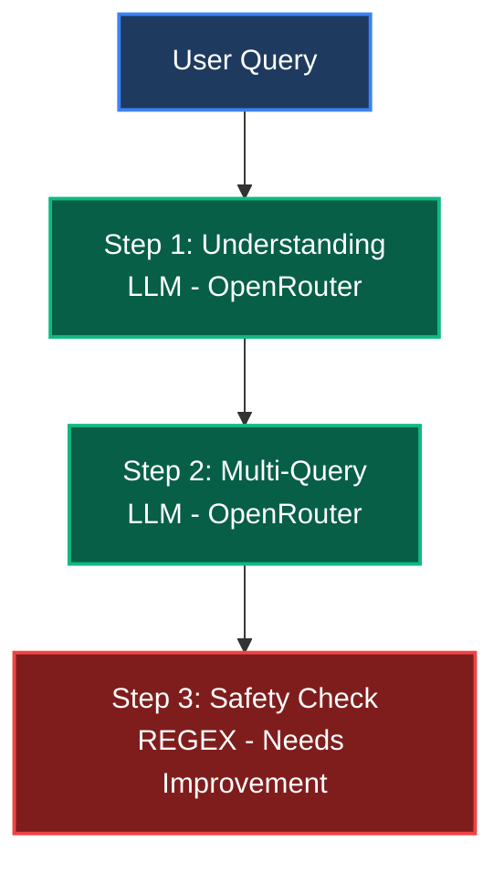

### Phase 2: Retrieval

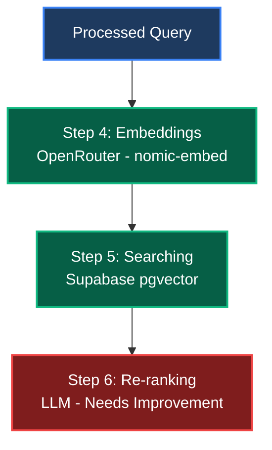

### Phase 3: Generation

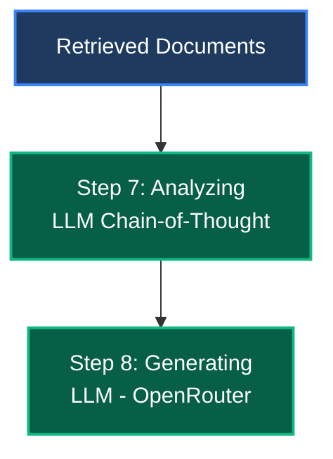

### Phase 4: Quality Assurance

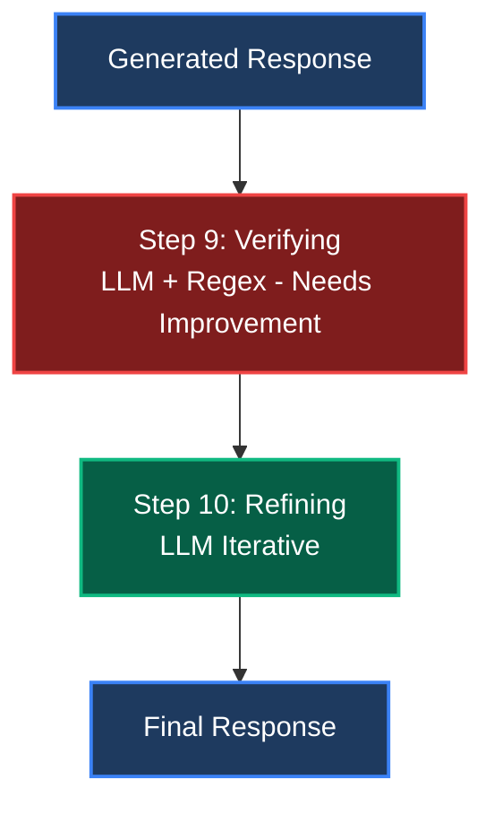

---

## Weak Points Identified

| Step | Current Implementation | Problem | Status |
|:----:|:-----------------------|:--------|:------:|
| 3 | Regex + Hardcoded Keywords | ~100 hardcoded words, fragile patterns, false positives/negatives | Needs Fix |
| 6 | LLM Scoring | One LLM call per document (~500ms each), slow and expensive | Needs Fix |
| 9 | LLM + Regex Heuristics | No real NLI for entailment verification, misses hallucinations | Needs Fix |

---

## Services and Models Map

**All services are FREE or very cheap (less than $3/month total)**

### OpenRouter Provider (Current)

| Model | Cost | Use Cases |
|:------|:----:|:----------|
| `google/gemini-2.0-flash-exp:free` | FREE | Query Understanding, Multi-Query, Reasoning, Generation |
| `openai/gpt-4o-mini` | $0.15/1M | LLM-as-Judge (backup) |
| `nomic-ai/nomic-embed-text-v1.5` | $0.02/1M | Embeddings (768 dimensions) |

### HuggingFace Inference API (New - All FREE)

| Model | Task | Rate Limit |
|:------|:-----|:-----------|
| `microsoft/deberta-v3-base-mnli` | NLI Verification | 30K req/hour |
| `BAAI/bge-reranker-base` | Cross-Encoder Reranking | 30K req/hour |
| `MoritzLaurer/deberta-v3-base-zeroshot-v2.0` | Zero-Shot Guardrails | 30K req/hour |
| `dslim/bert-base-NER` | Entity Extraction | 30K req/hour |

### Local Fallback Options (FREE)

| Model | Purpose |
|:------|:--------|
| `all-MiniLM-L6-v2` | Similarity when HuggingFace unavailable |
| `cross-encoder/ms-marco-MiniLM-L-6-v2` | Reranking when HuggingFace unavailable |

### Evaluation Tools

| Tool | Cost | Purpose |
|:-----|:----:|:--------|
| RAGAS | FREE | Automated evals (faithfulness, relevance) |
| LangSmith | FREE tier | Tracing, debugging (5,000 traces/month) |

---

## Pipeline Steps

### Step 1: Query Understanding

**Status: KEEP** - No changes needed

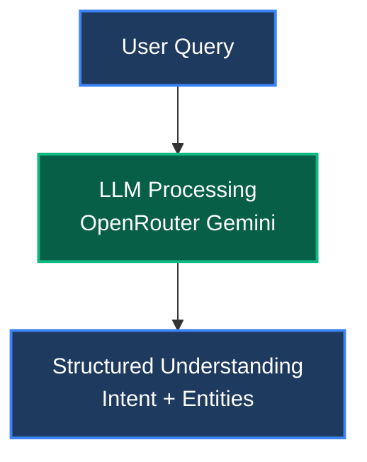

| Aspect | Value |
|:-------|:------|
| Provider | OpenRouter |
| Model | `google/gemini-2.0-flash-exp:free` |
| Cost | FREE |
| LangChain | Optional - PromptTemplate available |
| Action | Keep as is |

---

### Step 2: Multi-Query + HyDE

**Status: KEEP** - No changes needed

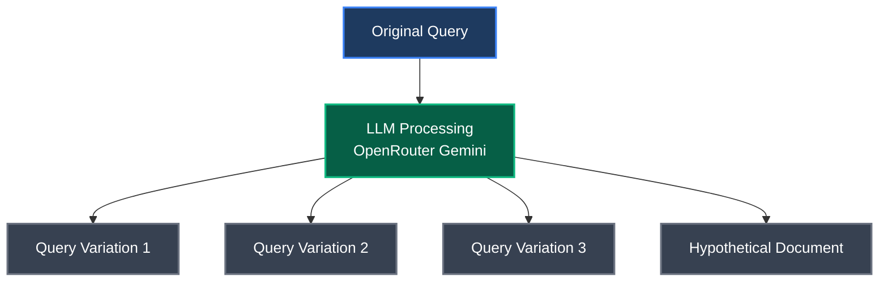

| Aspect | Value |
|:-------|:------|
| Provider | OpenRouter |
| Model | `google/gemini-2.0-flash-exp:free` |
| Cost | FREE |
| LangChain | Yes - MultiQueryRetriever available |
| Action | Consider LangChain MultiQueryRetriever |

---

### Step 3: Safety Check (Guardrails)

**Status: IMPROVE** - Replace hardcoded regex with ML classifier

#### Current Implementation (Fragile)

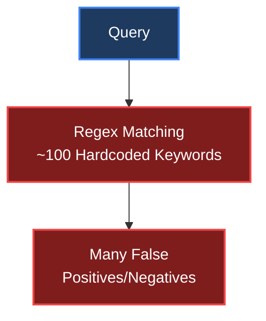

#### New Implementation (ML-Based)

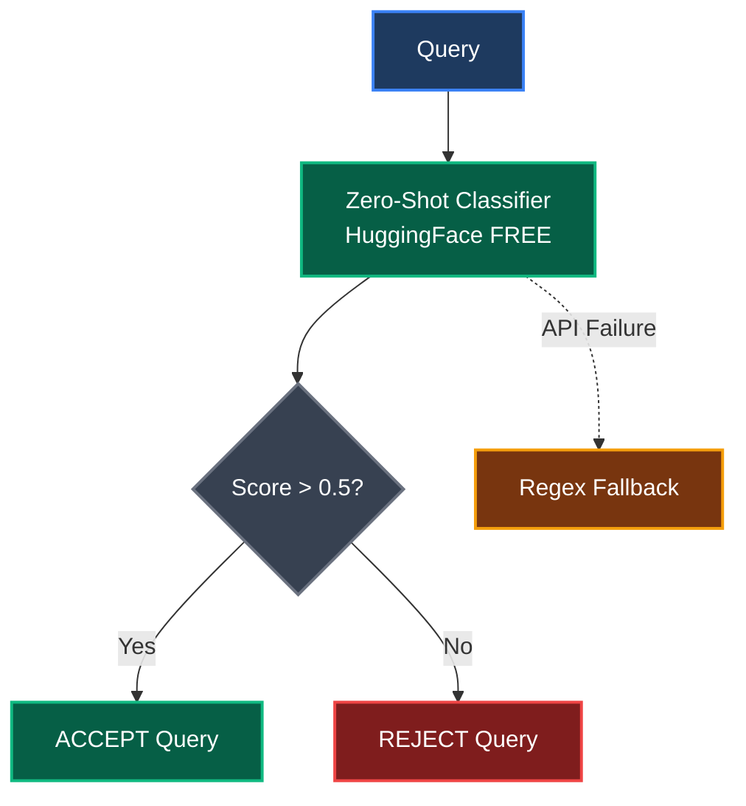

| Aspect | Value |
|:-------|:------|
| Provider | HuggingFace Inference API |
| Model | `MoritzLaurer/deberta-v3-base-zeroshot-v2.0` |
| Cost | FREE |
| Fallback | Keep regex as backup |
| Action | Add Zero-Shot classifier |

#### Example: Off-topic Query (REJECT)

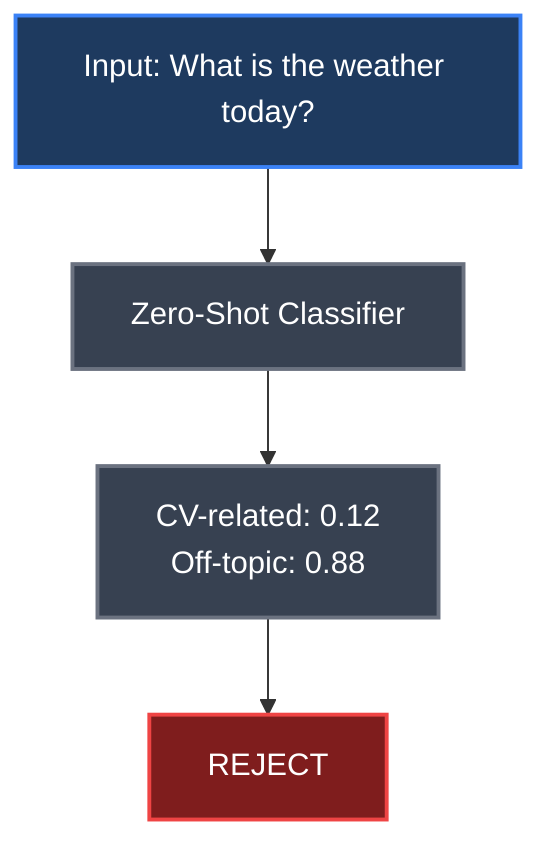

#### Example: Valid Query (ACCEPT)

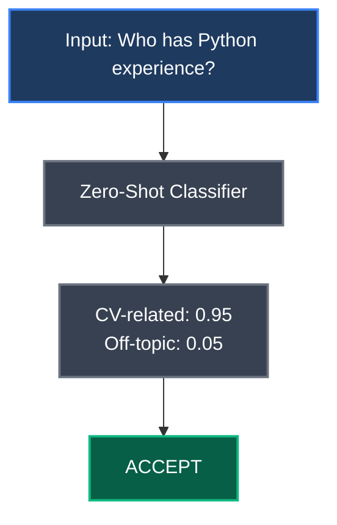

---

### Step 4: Embeddings

**Status: KEEP** - Optional migration to free alternative

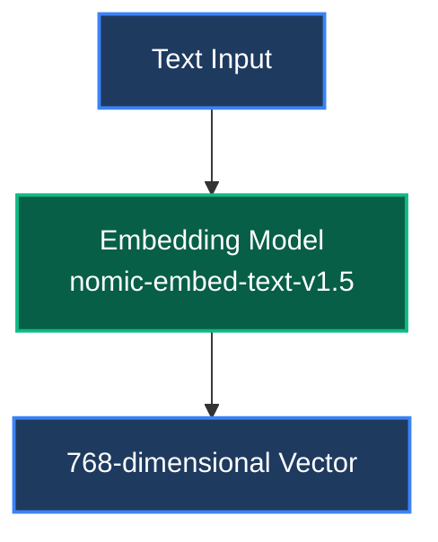

| Aspect | Value |
|:-------|:------|
| Provider | OpenRouter |
| Model | `nomic-ai/nomic-embed-text-v1.5` |
| Dimensions | 768 |
| Cost | $0.02/1M tokens |
| Alternative | HuggingFace `BAAI/bge-base-en-v1.5` (FREE) |
| Action | Keep or migrate to free HuggingFace |

---

### Step 5: Searching CVs

**Status: KEEP** - No changes needed

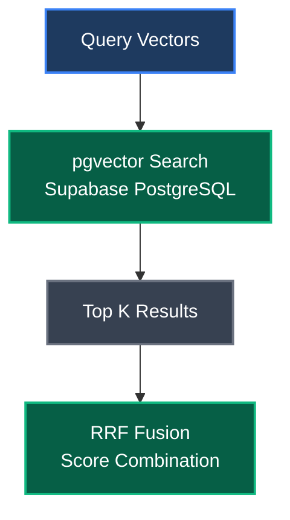

| Aspect | Value |
|:-------|:------|
| Provider | Supabase |
| Technology | pgvector (PostgreSQL) |
| Cost | FREE tier |
| LangChain | Yes - SupabaseVectorStore available |
| Action | Keep as is |

---

### Step 6: Re-ranking

**Status: IMPROVE** - Replace slow LLM with fast Cross-Encoder

#### Current Implementation (Slow and Expensive)

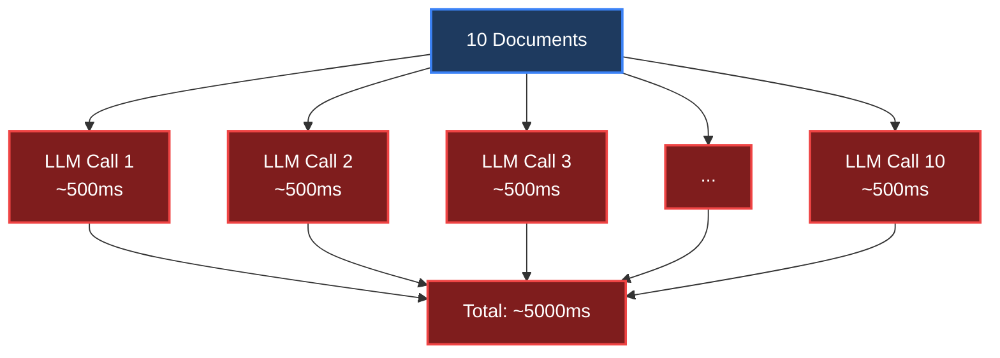

#### New Implementation (Fast and Free)

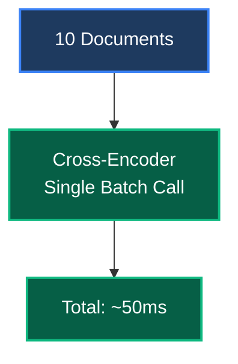

| Aspect | Value |
|:-------|:------|
| Provider | HuggingFace Inference API |
| Model | `BAAI/bge-reranker-base` |
| Speed | ~50ms for 10 docs (vs 5000ms with LLM) |
| Cost | FREE |
| Action | Replace LLM reranking with Cross-Encoder |

#### Alternative Reranker Models

| Model | Characteristics |
|:------|:----------------|
| `BAAI/bge-reranker-v2-m3` | Better quality, larger |
| `cross-encoder/ms-marco-MiniLM-L-6-v2` | Faster |
| `mixedbread-ai/mxbai-rerank-base-v1` | Very good quality |

---

### Step 7: Analyzing (Reasoning)

**Status: KEEP** - No changes needed

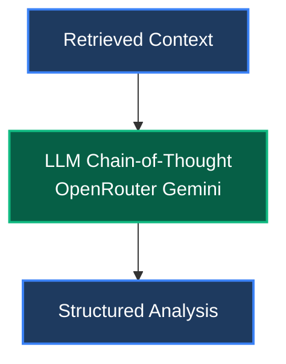

| Aspect | Value |
|:-------|:------|
| Provider | OpenRouter |
| Model | `google/gemini-2.0-flash-exp:free` |
| Cost | FREE |
| LangGraph | Consider for multi-step reasoning |
| Action | Keep, consider LangGraph for complex flows |

---

### Step 8: Generating

**Status: KEEP** - No changes needed

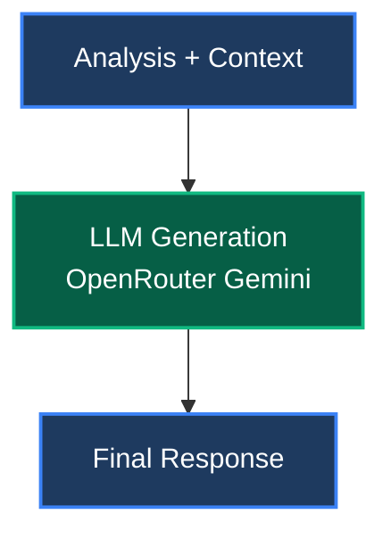

| Aspect | Value |
|:-------|:------|
| Provider | OpenRouter |
| Model | `google/gemini-2.0-flash-exp:free` |
| Cost | FREE |
| LangChain | Yes - ChatOpenAI compatible |
| Action | Keep, integrate LangChain for standardization |

---

### Step 9: Verifying

**Status: IMPROVE** - Add NLI verification for hallucination detection

#### Current Implementation (Fragile)

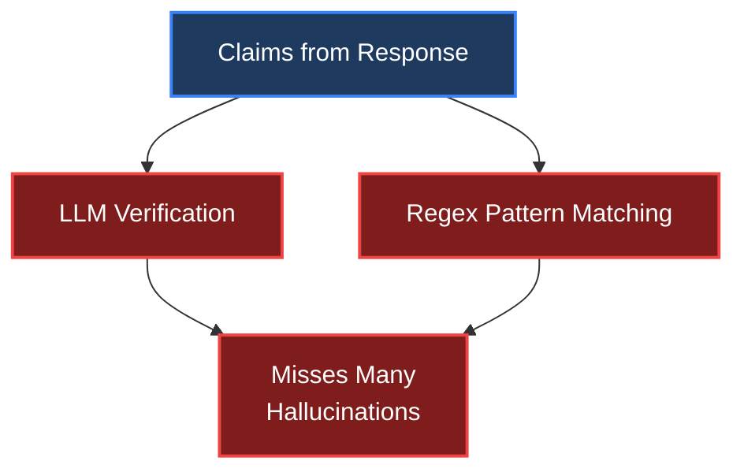

#### New Implementation (NLI-Based)

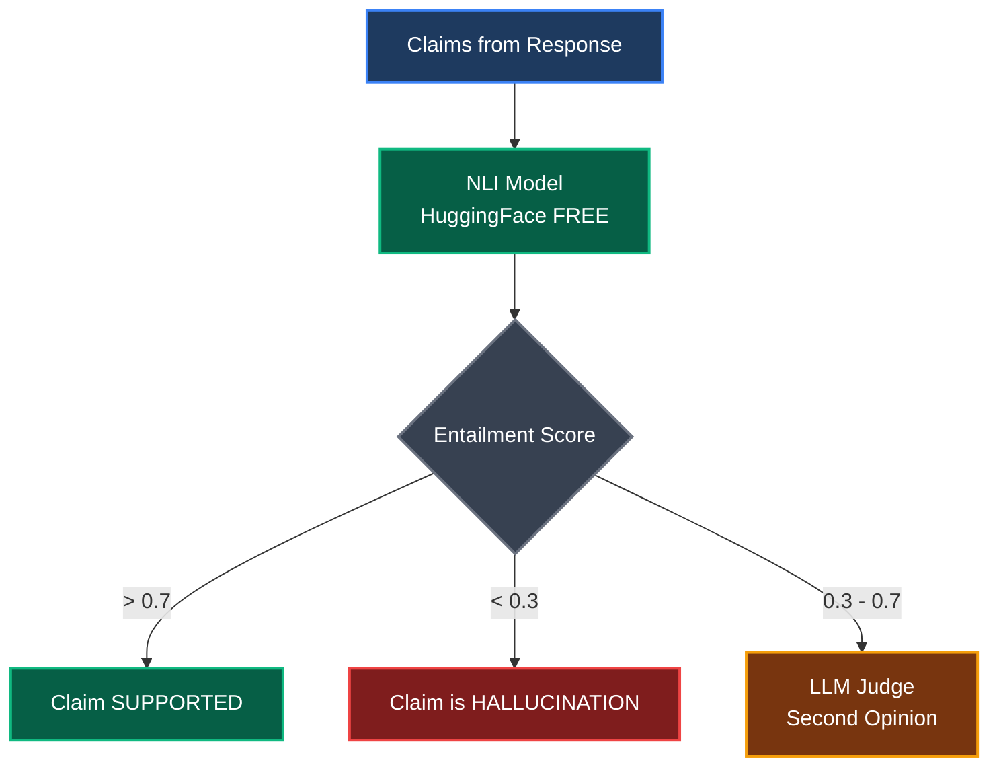

| Aspect | Value |
|:-------|:------|
| Provider | HuggingFace Inference API |
| Model | `microsoft/deberta-v3-base-mnli` |
| Cost | FREE |
| Action | Add NLI verification layer |

#### NLI Example: Supported Claim

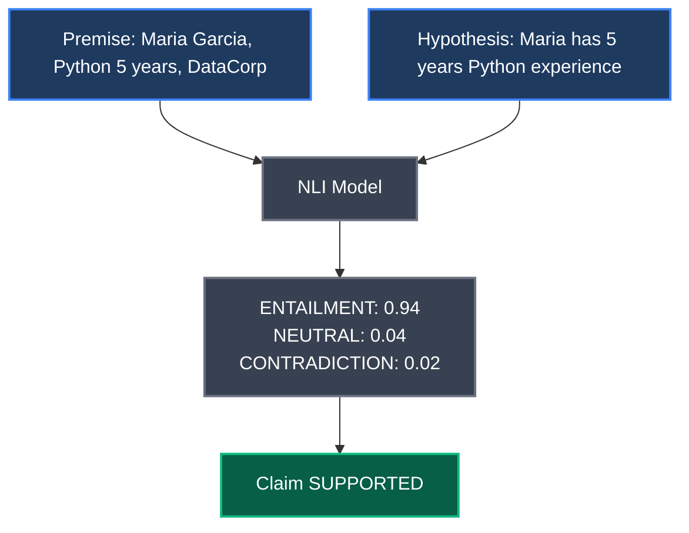

#### NLI Example: Hallucination Detected

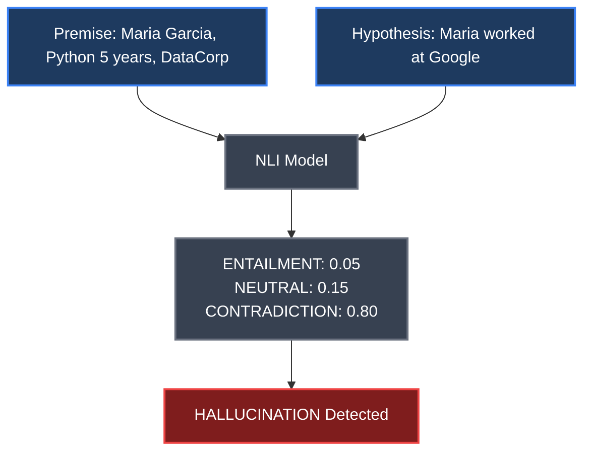

#### Combined Verification Strategy

```mermaid
flowchart LR
    A[1. Extract Claims<br/>with LLM] --> B[2. Verify Each Claim<br/>with NLI Model]
    B --> C[3. LLM Judge for<br/>Uncertain Cases]
    
    style A fill:#1e3a5f,stroke:#3b82f6,stroke-width:2px,color:#ffffff
    style B fill:#065f46,stroke:#10b981,stroke-width:2px,color:#ffffff
    style C fill:#78350f,stroke:#f59e0b,stroke-width:2px,color:#ffffff
```

---

### Step 10: Refining

**Status: KEEP** - Consider LangGraph for loop control

```mermaid
flowchart TB
    A[Initial Response] --> B[LLM Refinement<br/>OpenRouter Gemini]
    B --> C{Quality OK?}
    C -->|No| B
    C -->|Yes| D[Final Response]
    
    style A fill:#1e3a5f,stroke:#3b82f6,stroke-width:2px,color:#ffffff
    style B fill:#065f46,stroke:#10b981,stroke-width:2px,color:#ffffff
    style C fill:#374151,stroke:#6b7280,stroke-width:2px,color:#ffffff
    style D fill:#1e3a5f,stroke:#3b82f6,stroke-width:2px,color:#ffffff
```

| Aspect | Value |
|:-------|:------|
| Provider | OpenRouter |
| Model | `google/gemini-2.0-flash-exp:free` |
| Cost | FREE |
| LangGraph | Yes - ideal for refinement loops |
| Action | Consider LangGraph for loop control |

---

## LangChain vs LangGraph

### LangChain - Component Library

**Use LangChain for:**
- LLM wrappers (ChatOpenAI compatible with OpenRouter)
- Embeddings wrappers (HuggingFaceEmbeddings)
- Vector stores (SupabaseVectorStore)
- Prompt templates
- Output parsers (JSON, structured)
- Document loaders (PDF)
- Text splitters (chunking)

**Do NOT use LangChain for:**
- Complex orchestration
- Stateful flows
- Conditional branching
- Human-in-the-loop

### LangGraph - Orchestration Framework

**Use LangGraph for:**
- RAG pipeline as state graph
- Conditional branching (if confidence < 0.5 then retry)
- Refinement loops with exit conditions
- Human-in-the-loop (confirmation requests)
- Checkpointing (save state)
- Streaming intermediate steps

**Do NOT use LangGraph for:**
- Simple linear pipelines
- If current code works well

### Recommendation for This Project

1. **Do NOT migrate everything** to LangChain/LangGraph now - current Python code works
2. **Use LangChain ONLY for**: LLM wrapper, Embeddings wrapper, SupabaseVectorStore
3. **Consider LangGraph for**: Refinement loop (step 10), Human-in-the-loop, Checkpointing
4. **PRIORITIZE specific models over refactoring**: Adding NLI has more impact than LangGraph

---

## Proposed Architecture v6

### Changes Summary

| Step | Current | v6 Change | New Provider/Model |
|:----:|:--------|:----------|:-------------------|
| 1 | OpenRouter LLM | No change | - |
| 2 | OpenRouter LLM | No change | - |
| **3** | Regex | **ADD** Zero-Shot | HuggingFace deberta-zeroshot |
| 4 | OpenRouter | Optional | HuggingFace bge-base-en (FREE) |
| 5 | Supabase | No change | - |
| **6** | LLM | **REPLACE** Cross-Encoder | HuggingFace bge-reranker-base |
| 7 | OpenRouter LLM | No change | - |
| 8 | OpenRouter LLM | No change | - |
| **9** | LLM + Regex | **ADD** NLI | HuggingFace deberta-mnli |
| 10 | OpenRouter LLM | Optional | LangGraph for loops |

---

## New Services to Add

### Service 1: HuggingFace Inference Client

**File**: `backend/app/providers/huggingface_client.py`

<details>
<summary>Click to expand code</summary>

```python
import httpx
from app.config import settings

class HuggingFaceClient:
    """Client for HuggingFace Inference API."""
    
    BASE_URL = "https://api-inference.huggingface.co/models"
    
    def __init__(self):
        self.api_key = settings.huggingface_api_key
        self.headers = {"Authorization": f"Bearer {self.api_key}"}
    
    async def zero_shot_classification(
        self,
        text: str,
        labels: list[str],
        model: str = "MoritzLaurer/deberta-v3-base-zeroshot-v2.0"
    ) -> dict:
        """Classify text into labels."""
        async with httpx.AsyncClient(timeout=30.0) as client:
            response = await client.post(
                f"{self.BASE_URL}/{model}",
                headers=self.headers,
                json={
                    "inputs": text,
                    "parameters": {"candidate_labels": labels}
                }
            )
            return response.json()
    
    async def nli_inference(
        self,
        premise: str,
        hypothesis: str,
        model: str = "microsoft/deberta-v3-base-mnli"
    ) -> dict:
        """Natural Language Inference."""
        async with httpx.AsyncClient(timeout=30.0) as client:
            response = await client.post(
                f"{self.BASE_URL}/{model}",
                headers=self.headers,
                json={"inputs": f"{premise} [SEP] {hypothesis}"}
            )
            result = response.json()
            return {
                "entailment": self._get_score(result, "ENTAILMENT"),
                "neutral": self._get_score(result, "NEUTRAL"),
                "contradiction": self._get_score(result, "CONTRADICTION")
            }
    
    async def rerank(
        self,
        query: str,
        documents: list[str],
        model: str = "BAAI/bge-reranker-base"
    ) -> list[dict]:
        """Rerank documents by relevance."""
        pairs = [[query, doc] for doc in documents]
        
        async with httpx.AsyncClient(timeout=30.0) as client:
            response = await client.post(
                f"{self.BASE_URL}/{model}",
                headers=self.headers,
                json={"inputs": pairs}
            )
            scores = response.json()
        
        results = [
            {"document": doc, "score": score}
            for doc, score in zip(documents, scores)
        ]
        return sorted(results, key=lambda x: x["score"], reverse=True)
    
    def _get_score(self, result: list, label: str) -> float:
        for item in result:
            if item.get("label", "").upper() == label:
                return item.get("score", 0.0)
        return 0.0
```

</details>

### Service 2: Enhanced Guardrail Service

**File**: `backend/app/services/guardrail_service_v2.py`

<details>
<summary>Click to expand code</summary>

```python
from app.providers.huggingface_client import HuggingFaceClient

class GuardrailServiceV2:
    """Enhanced guardrails with zero-shot classification."""
    
    def __init__(self):
        self.hf_client = HuggingFaceClient()
        self.legacy_guardrails = GuardrailService()
    
    async def check_query(self, query: str) -> dict:
        """Check if query is CV-related."""
        
        try:
            result = await self.hf_client.zero_shot_classification(
                text=query,
                labels=[
                    "question about job candidates or CVs",
                    "question about resumes or work experience",
                    "off-topic question not related to hiring"
                ]
            )
            
            cv_score = (
                result.get("scores", [0, 0, 0])[0] +
                result.get("scores", [0, 0, 0])[1]
            ) / 2
            
            return {
                "is_allowed": cv_score > 0.5,
                "confidence": cv_score,
                "method": "zero-shot-classifier",
                "details": result
            }
            
        except Exception as e:
            legacy_result = self.legacy_guardrails.check(query)
            return {
                "is_allowed": legacy_result["passed"],
                "confidence": 0.5,
                "method": "regex-fallback",
                "error": str(e)
            }
```

</details>

### Service 3: NLI Verification Service

**File**: `backend/app/services/nli_verification_service.py`

<details>
<summary>Click to expand code</summary>

```python
from app.providers.huggingface_client import HuggingFaceClient

class NLIVerificationService:
    """Verify claims using Natural Language Inference."""
    
    def __init__(self):
        self.hf_client = HuggingFaceClient()
    
    async def verify_claim(
        self,
        claim: str,
        context_chunks: list[str]
    ) -> dict:
        """Verify if a claim is supported by context."""
        best_entailment = 0.0
        best_contradiction = 0.0
        supporting_chunks = []
        
        for i, chunk in enumerate(context_chunks):
            result = await self.hf_client.nli_inference(
                premise=chunk,
                hypothesis=claim
            )
            
            if result["entailment"] > 0.7:
                supporting_chunks.append(i)
                best_entailment = max(best_entailment, result["entailment"])
            
            best_contradiction = max(best_contradiction, result["contradiction"])
        
        if best_entailment > 0.7:
            status = "supported"
            confidence = best_entailment
        elif best_contradiction > 0.7:
            status = "contradicted"
            confidence = best_contradiction
        else:
            status = "unsupported"
            confidence = 1 - max(best_entailment, best_contradiction)
        
        return {
            "claim": claim,
            "status": status,
            "confidence": confidence,
            "supporting_chunks": supporting_chunks
        }
    
    async def compute_faithfulness(
        self,
        claims: list[str],
        context_chunks: list[str]
    ) -> float:
        """Compute overall faithfulness score."""
        if not claims:
            return 1.0
        
        supported = 0
        for claim in claims:
            result = await self.verify_claim(claim, context_chunks)
            if result["status"] == "supported":
                supported += 1
            elif result["status"] == "contradicted":
                supported -= 0.5
        
        return max(0, supported / len(claims))
```

</details>

### Service 4: Cross-Encoder Reranking Service

**File**: `backend/app/services/reranking_service_v2.py`

<details>
<summary>Click to expand code</summary>

```python
from app.providers.huggingface_client import HuggingFaceClient

class CrossEncoderRerankingService:
    """Fast reranking using cross-encoder models."""
    
    def __init__(self):
        self.hf_client = HuggingFaceClient()
        self.llm_reranker = RerankingService()
    
    async def rerank(
        self,
        query: str,
        documents: list[dict],
        top_k: int = 5
    ) -> list[dict]:
        """Rerank documents using cross-encoder."""
        
        if not documents:
            return []
        
        try:
            texts = [doc.get("content", "") for doc in documents]
            
            ranked = await self.hf_client.rerank(
                query=query,
                documents=texts,
                model="BAAI/bge-reranker-base"
            )
            
            result = []
            for item in ranked[:top_k]:
                idx = texts.index(item["document"])
                doc = documents[idx].copy()
                doc["rerank_score"] = item["score"]
                result.append(doc)
            
            return result
            
        except Exception as e:
            return await self.llm_reranker.rerank(query, documents, top_k)
```

</details>

---

## Configuration

### Environment Variables

Add to `.env`:

```bash
# HuggingFace Inference API (FREE)
# Get from: https://huggingface.co/settings/tokens
HUGGINGFACE_API_KEY=hf_...

# Model configuration
HF_NLI_MODEL=microsoft/deberta-v3-base-mnli
HF_RERANKER_MODEL=BAAI/bge-reranker-base
HF_ZEROSHOT_MODEL=MoritzLaurer/deberta-v3-base-zeroshot-v2.0

# Feature flags
USE_HF_GUARDRAILS=true
USE_HF_RERANKER=true
USE_HF_NLI=true
```

### Dependencies

Add to `requirements.txt`:

```txt
# HuggingFace
huggingface-hub>=0.20.0

# RAGAS for evals
ragas>=0.1.0
datasets>=2.16.0

# LangChain (optional)
langchain>=0.1.0
langchain-community>=0.0.10

# LangGraph (optional)
langgraph>=0.0.20

# LangSmith (optional)
langsmith>=0.0.83
```

---

## Implementation Priority

### Phase 1: Quick Wins (2-3 hours) - HIGH IMPACT

- [ ] Add HuggingFace API client
- [ ] Implement Cross-Encoder reranking
- [ ] Add NLI verification service

### Phase 2: Guardrails Upgrade (1-2 hours)

- [ ] Add Zero-Shot classifier for guardrails
- [ ] Keep regex as fallback

### Phase 3: Integration (2-3 hours)

- [ ] Integrate NLI into verification step
- [ ] Integrate Cross-Encoder into reranking step
- [ ] Update confidence calculation with new signals

### Phase 4: Evals (1-2 hours)

- [ ] Add RAGAS evaluation
- [ ] Create eval dataset from existing queries

### Phase 5: Optional - LangGraph (3-4 hours)

- [ ] Refactor pipeline to LangGraph (only if needed)
- [ ] Add checkpointing
- [ ] Add human-in-the-loop for low confidence

---

## Cost Summary

### Monthly Costs

| Component | Provider | Cost |
|:----------|:---------|-----:|
| LLM (Gemini) | OpenRouter | FREE |
| Embeddings | OpenRouter | ~$0.50 |
| Zero-Shot Guardrails | HuggingFace | FREE |
| Cross-Encoder Reranking | HuggingFace | FREE |
| NLI Verification | HuggingFace | FREE |
| LLM Judge (backup) | OpenRouter | ~$1-2 |
| **TOTAL** | | **~$2-3/month** |

---

## Files Overview

### Files to Create

| File | Purpose |
|:-----|:--------|
| `backend/app/providers/huggingface_client.py` | HuggingFace API client |
| `backend/app/services/guardrail_service_v2.py` | Zero-shot guardrails |
| `backend/app/services/nli_verification_service.py` | NLI claim verification |
| `backend/app/services/reranking_service_v2.py` | Cross-encoder reranking |

### Files to Update

| File | Changes |
|:-----|:--------|
| `backend/app/services/rag_service_v5.py` | Integrate new services (becomes v6) |
| `backend/app/services/hallucination_service.py` | Add NLI verification |
| `backend/app/services/confidence_calculator.py` | Add NLI signals |
| `backend/app/config.py` | Add HuggingFace settings |
| `backend/requirements.txt` | Add dependencies |

---

## Success Criteria

| Metric | Target | How to Measure |
|:-------|:-------|:---------------|
| Cross-Encoder speed | 10x faster than LLM reranking | Benchmark before/after |
| NLI hallucination detection | Catches hallucinations regex missed | Test with known cases |
| Zero-shot false positives | Fewer than regex | A/B test on sample queries |
| Pipeline latency | Under 5 seconds | End-to-end timing |
| API costs | No increase | Monitor billing |

### Checklist

- [ ] Cross-Encoder reranking is 10x faster than LLM reranking
- [ ] NLI verification catches hallucinations that regex missed
- [ ] Zero-shot guardrails have fewer false positives than regex
- [ ] Overall pipeline latency stays under 5 seconds
- [ ] No increase in API costs (all new services are FREE)
