# CV Screener RAG v6 - Implementation Plan

> **Goal**: Upgrade the RAG pipeline from v5 to v6 by replacing hardcoded/inefficient components with specialized ML models while keeping costs near zero.

---

## Table of Contents

- [Current Pipeline Analysis](#-current-pipeline-analysis-v5)
- [Services & Models Map](#-services--models-map)
- [Pipeline Step-by-Step](#-pipeline-step-by-step)
- [LangChain vs LangGraph](#-langchain-vs-langgraph)
- [Proposed Architecture v6](#-proposed-architecture-v6)
- [New Services to Add](#-new-services-to-add)
- [Configuration](#-configuration)
- [Implementation Priority](#-implementation-priority)
- [Cost Summary](#-cost-summary)
- [Files Overview](#-files-overview)
- [Success Criteria](#-success-criteria)

---

## 📊 Current Pipeline Analysis (v5)

### Pipeline Overview

```mermaid
flowchart LR
    subgraph Phase1["🔍 Query Processing"]
        A["1. Understanding<br/>✅ LLM"] --> B["2. Multi-Query<br/>✅ LLM"]
        B --> C["3. Safety<br/>⚠️ REGEX"]
    end
    
    subgraph Phase2["📥 Retrieval"]
        C --> D["4. Embeddings<br/>✅ OpenRouter"]
        D --> E["5. Searching<br/>✅ pgvector"]
        E --> F["6. Re-ranking<br/>⚠️ LLM"]
    end
    
    subgraph Phase3["✨ Generation"]
        F --> G["7. Analyzing<br/>✅ LLM"]
        G --> H["8. Generating<br/>✅ LLM"]
    end
    
    subgraph Phase4["✅ Quality Assurance"]
        H --> I["9. Verifying<br/>⚠️ LLM+Regex"]
        I --> J["10. Refining<br/>✅ LLM"]
    end
    
    style C fill:#ffcccc,stroke:#cc0000,stroke-width:2px
    style F fill:#ffcccc,stroke:#cc0000,stroke-width:2px
    style I fill:#ffcccc,stroke:#cc0000,stroke-width:2px
```

### Weak Points Identified

| Step | Current Implementation | Problem | Impact |
|:----:|:-----------------------|:--------|:------:|
| **3** | Regex + Hardcoded Keywords | ~100 hardcoded words, fragile patterns | ❌ False positives/negatives |
| **6** | LLM Scoring | One LLM call per document (~500ms each) | ❌ Slow & expensive |
| **9** | LLM + Regex Heuristics | No real NLI for entailment verification | ❌ Misses hallucinations |

---

## 🛠️ Services & Models Map

> 💡 **All services are FREE or very cheap** (< $3/month total)

### Provider Ecosystem


### Detailed Provider Comparison

#### 🌐 OpenRouter (Current Provider)

| Model | Cost | Use Cases |
|:------|:----:|:----------|
| `google/gemini-2.0-flash-exp:free` | **FREE** | Query Understanding, Multi-Query, Reasoning, Generation |
| `openai/gpt-4o-mini` | $0.15/1M | LLM-as-Judge (backup) |
| `nomic-ai/nomic-embed-text-v1.5` | $0.02/1M | Embeddings (768 dimensions) |

#### 🤗 HuggingFace Inference API (New)

| Model | Cost | Use Cases |
|:------|:----:|:----------|
| `microsoft/deberta-v3-base-mnli` | **FREE** | NLI Verification |
| `BAAI/bge-reranker-base` | **FREE** | Cross-Encoder Reranking |
| `MoritzLaurer/deberta-v3-base-zeroshot-v2.0` | **FREE** | Zero-Shot Guardrails |
| `dslim/bert-base-NER` | **FREE** | Entity Extraction |

> 📈 **Rate Limit**: HuggingFace allows **30,000 requests/hour** (more than sufficient)

#### 💻 Local Fallback Options

| Model | Purpose | When to Use |
|:------|:--------|:------------|
| `all-MiniLM-L6-v2` | Similarity | HuggingFace API unavailable |
| `cross-encoder/ms-marco-MiniLM-L-6-v2` | Reranking | HuggingFace API unavailable |

#### 📊 Evaluation Tools

| Tool | Cost | Purpose |
|:-----|:----:|:--------|
| **RAGAS** | FREE | Automated evals (faithfulness, relevance, etc.) |
| **LangSmith** | FREE tier | Tracing, debugging, observability (5,000 traces/month) |

---

## 🔧 Pipeline Step-by-Step

### Step 1: Query Understanding ✅ KEEP

```mermaid
flowchart LR
    subgraph Step1["Step 1: Query Understanding"]
        Input["User Query"] --> LLM["🤖 LLM<br/>OpenRouter"]
        LLM --> Output["Structured<br/>Understanding"]
    end
    
    style LLM fill:#90EE90,stroke:#228B22
```

| Aspect | Details |
|:-------|:--------|
| **Current** | ✅ LLM (OpenRouter) |
| **Change?** | No - LLM required for intent understanding |
| **Provider** | OpenRouter |
| **Model** | `google/gemini-2.0-flash-exp:free` |
| **Cost** | FREE |
| **LangChain** | Optional - `PromptTemplate` can help |
| **LangGraph** | Not needed |
| **Action** | Keep as is |

---

### Step 2: Multi-Query + HyDE ✅ KEEP

```mermaid
flowchart LR
    subgraph Step2["Step 2: Multi-Query + HyDE"]
        Query["Original<br/>Query"] --> LLM["🤖 LLM<br/>OpenRouter"]
        LLM --> Q1["Query<br/>Variation 1"]
        LLM --> Q2["Query<br/>Variation 2"]
        LLM --> Q3["Query<br/>Variation 3"]
        LLM --> HyDE["Hypothetical<br/>Document"]
    end
    
    style LLM fill:#90EE90,stroke:#228B22
```

| Aspect | Details |
|:-------|:--------|
| **Current** | ✅ LLM (OpenRouter) |
| **Change?** | No - LLM required for query variations |
| **Provider** | OpenRouter |
| **Model** | `google/gemini-2.0-flash-exp:free` |
| **Cost** | FREE |
| **LangChain** | Yes - `MultiQueryRetriever` is available |
| **LangGraph** | Not needed |
| **Action** | Consider LangChain `MultiQueryRetriever` to simplify |

---

### Step 3: Safety Check (Guardrails) ⚠️ IMPROVE

```mermaid
flowchart TB
    subgraph Current["❌ Current: Fragile"]
        Query1["Query"] --> Regex["Regex +<br/>Hardcoded Keywords"]
        Regex --> Result1["Many false<br/>positives/negatives"]
    end
    
    subgraph New["✅ New: ML-Based"]
        Query2["Query"] --> ZeroShot["🤗 Zero-Shot<br/>Classifier"]
        ZeroShot --> Result2["Accurate<br/>Classification"]
        ZeroShot -.->|fallback| Regex2["Regex<br/>Fallback"]
    end
    
    style Regex fill:#ffcccc,stroke:#cc0000
    style ZeroShot fill:#90EE90,stroke:#228B22
```

| Aspect | Details |
|:-------|:--------|
| **Current** | ⚠️ Regex + ~100 hardcoded keywords |
| **Problem** | Doesn't scale, many false positives/negatives |
| **Solution** | Zero-Shot Classification (HuggingFace FREE) |
| **Provider** | HuggingFace Inference API |
| **Model** | `MoritzLaurer/deberta-v3-base-zeroshot-v2.0` |
| **Cost** | FREE |
| **LangChain** | Not needed |
| **LangGraph** | Not needed |
| **Action** | Add Zero-Shot classifier + keep regex as fallback |

#### Zero-Shot Classification Examples

```mermaid
flowchart LR
    subgraph Example1["❌ Off-topic Query"]
        Q1["'What's the weather today?'"] --> ZS1["Zero-Shot"]
        ZS1 --> R1["CV-related: 0.12<br/>Off-topic: 0.88"]
        R1 --> Reject["🚫 REJECT"]
    end
    
    subgraph Example2["✅ Valid Query"]
        Q2["'Who has Python experience?'"] --> ZS2["Zero-Shot"]
        ZS2 --> R2["CV-related: 0.95<br/>Off-topic: 0.05"]
        R2 --> Accept["✅ ACCEPT"]
    end
    
    style Reject fill:#ffcccc
    style Accept fill:#90EE90
```

---

### Step 4: Embeddings ✅ KEEP

```mermaid
flowchart LR
    subgraph Step4["Step 4: Embeddings"]
        Text["Text"] --> Embed["🔢 Embedding Model"]
        Embed --> Vector["768-dim Vector"]
    end
    
    style Embed fill:#90EE90,stroke:#228B22
```

| Aspect | Details |
|:-------|:--------|
| **Current** | ✅ OpenRouter (nomic-embed) |
| **Provider** | OpenRouter |
| **Model** | `nomic-ai/nomic-embed-text-v1.5` |
| **Dimensions** | 768 |
| **Cost** | $0.02/1M tokens (very cheap) |
| **Alternative** | HuggingFace `BAAI/bge-base-en-v1.5` (FREE) |
| **LangChain** | Yes - `HuggingFaceEmbeddings` wrapper |
| **LangGraph** | Not needed |
| **Action** | Keep OpenRouter or migrate to free HuggingFace |

---

### Step 5: Searching CVs ✅ KEEP

```mermaid
flowchart LR
    subgraph Step5["Step 5: Vector Search"]
        Query["Query<br/>Vectors"] --> PG["🐘 pgvector<br/>Supabase"]
        PG --> Results["Top K<br/>Results"]
        Results --> Fusion["RRF<br/>Fusion"]
    end
    
    style PG fill:#90EE90,stroke:#228B22
```

| Aspect | Details |
|:-------|:--------|
| **Current** | ✅ Supabase pgvector + Fusion |
| **Provider** | Supabase |
| **Technology** | pgvector (PostgreSQL) |
| **Cost** | FREE tier |
| **Notes** | RRF-like fusion implementation is good |
| **LangChain** | Yes - `SupabaseVectorStore` available |
| **LangGraph** | Not needed |
| **Action** | Keep as is |

---

### Step 6: Re-ranking ⚠️ IMPROVE

```mermaid
flowchart TB
    subgraph Current["❌ Current: Slow & Expensive"]
        Docs1["10 Documents"] --> LLM1["LLM Call 1"]
        Docs1 --> LLM2["LLM Call 2"]
        Docs1 --> LLM3["..."]
        Docs1 --> LLM10["LLM Call 10"]
        LLM1 & LLM2 & LLM3 & LLM10 --> Time1["⏱️ ~5000ms"]
    end
    
    subgraph New["✅ New: Fast & Free"]
        Docs2["10 Documents"] --> CrossEnc["🤗 Cross-Encoder<br/>Single Batch Call"]
        CrossEnc --> Time2["⚡ ~50ms"]
    end
    
    style LLM1 fill:#ffcccc,stroke:#cc0000
    style LLM2 fill:#ffcccc,stroke:#cc0000
    style LLM3 fill:#ffcccc,stroke:#cc0000
    style LLM10 fill:#ffcccc,stroke:#cc0000
    style CrossEnc fill:#90EE90,stroke:#228B22
```

| Aspect | Details |
|:-------|:--------|
| **Current** | ⚠️ LLM scoring (slow & expensive) |
| **Problem** | ~500ms per document, costly with paid models |
| **Solution** | Cross-Encoder (HuggingFace FREE) |
| **Provider** | HuggingFace Inference API |
| **Model** | `BAAI/bge-reranker-base` |
| **Speed** | ~50ms for 10 documents (vs 5000ms with LLM) |
| **Cost** | FREE |
| **LangChain** | Yes - `CohereRerank` or custom reranker |
| **LangGraph** | Not needed |
| **Action** | Replace LLM reranking with Cross-Encoder |

#### Alternative Reranker Models

| Model | Characteristics |
|:------|:----------------|
| `BAAI/bge-reranker-v2-m3` | Better quality, larger |
| `cross-encoder/ms-marco-MiniLM-L-6-v2` | Faster |
| `mixedbread-ai/mxbai-rerank-base-v1` | Very good quality |

---

### Step 7: Analyzing (Reasoning) ✅ KEEP


| Aspect | Details |
|:-------|:--------|
| **Current** | ✅ LLM Chain-of-Thought |
| **Provider** | OpenRouter |
| **Model** | `google/gemini-2.0-flash-exp:free` |
| **Cost** | FREE |
| **Notes** | Chain-of-Thought requires LLM, no better alternative |
| **LangChain** | Optional - has CoT prompts |
| **LangGraph** | Consider for multi-step reasoning |
| **Action** | Keep, consider LangGraph for complex flows |

---

### Step 8: Generating ✅ KEEP

```mermaid
flowchart LR
    subgraph Step8["Step 8: Response Generation"]
        Analysis["Analysis +<br/>Context"] --> LLM["🤖 LLM<br/>OpenRouter"]
        LLM --> Response["Final<br/>Response"]
    end
    
    style LLM fill:#90EE90,stroke:#228B22
```

| Aspect | Details |
|:-------|:--------|
| **Current** | ✅ LLM (OpenRouter) |
| **Provider** | OpenRouter |
| **Model** | `google/gemini-2.0-flash-exp:free` |
| **Cost** | FREE |
| **LangChain** | Yes - `ChatOpenAI` compatible with OpenRouter |
| **LangGraph** | Consider for branching/retry generation |
| **Action** | Keep, integrate LangChain for standardization |

---

### Step 9: Verifying ⚠️ IMPROVE

```mermaid
flowchart TB
    subgraph Current["❌ Current: Fragile"]
        Claims1["Claims"] --> LLM["LLM<br/>Verification"]
        Claims1 --> Regex["Regex<br/>Patterns"]
        LLM & Regex --> Result1["Misses<br/>Hallucinations"]
    end
    
    subgraph New["✅ New: NLI-Based"]
        Claims2["Claims"] --> NLI["🤗 NLI Model"]
        NLI --> Check{"Entailment<br/>Check"}
        Check -->|"Score > 0.7"| Supported["✅ Supported"]
        Check -->|"Score < 0.3"| Contradict["❌ Hallucination"]
        Check -->|"0.3-0.7"| LLM2["🤖 LLM Judge<br/>(backup)"]
    end
    
    style Regex fill:#ffcccc,stroke:#cc0000
    style NLI fill:#90EE90,stroke:#228B22
```

| Aspect | Details |
|:-------|:--------|
| **Current** | ⚠️ LLM + Regex heuristics |
| **Problem** | No real NLI for entailment verification |
| **Solution** | NLI Model (HuggingFace FREE) |
| **Provider** | HuggingFace Inference API |
| **Model** | `microsoft/deberta-v3-base-mnli` |
| **Cost** | FREE |
| **LangChain** | Not needed |
| **LangGraph** | Consider for verification flow with retry |
| **Action** | Add NLI verification before/after LLM verification |

#### NLI Verification Examples

<table>
<tr>
<th>✅ Supported Claim</th>
<th>❌ Hallucination</th>
</tr>
<tr>
<td>

**Premise (Context):**  
"Maria Garcia, Python 5 years, DataCorp"

**Hypothesis (Claim):**  
"Maria has 5 years of Python experience"

| Label | Score |
|:------|------:|
| ENTAILMENT | **0.94** ✓ |
| NEUTRAL | 0.04 |
| CONTRADICTION | 0.02 |

</td>
<td>

**Premise (Context):**  
"Maria Garcia, Python 5 years, DataCorp"

**Hypothesis (Claim):**  
"Maria worked at Google"

| Label | Score |
|:------|------:|
| ENTAILMENT | 0.05 |
| NEUTRAL | 0.15 |
| CONTRADICTION | **0.80** ✗ |

</td>
</tr>
</table>

#### Combined Verification Strategy


---

### Step 10: Refining ✅ KEEP


| Aspect | Details |
|:-------|:--------|
| **Current** | ✅ LLM iterative refinement |
| **Provider** | OpenRouter |
| **Model** | `google/gemini-2.0-flash-exp:free` |
| **Cost** | FREE |
| **LangChain** | Optional |
| **LangGraph** | Yes - ideal for refinement loops with conditions |
| **Action** | Consider LangGraph for loop control |

---

## 🔄 LangChain vs LangGraph

### Comparison

```mermaid
flowchart TB
    subgraph LC["🔗 LangChain"]
        direction TB
        LC1["Component Library<br/>for LLM Apps"]
        LC2["✅ LLM Wrappers"]
        LC3["✅ Embeddings"]
        LC4["✅ Vector Stores"]
        LC5["✅ Prompt Templates"]
        LC6["✅ Output Parsers"]
        LC7["❌ Complex Orchestration"]
        LC8["❌ Stateful Flows"]
    end
    
    subgraph LG["📊 LangGraph"]
        direction TB
        LG1["Orchestration Framework<br/>with States & Graphs"]
        LG2["✅ RAG as State Graph"]
        LG3["✅ Conditional Branching"]
        LG4["✅ Refinement Loops"]
        LG5["✅ Human-in-the-loop"]
        LG6["✅ Checkpointing"]
        LG7["❌ Simple Linear Pipelines"]
        LG8["❌ If current code works"]
    end
```

### When to Use Each

| Use Case | LangChain | LangGraph |
|:---------|:---------:|:---------:|
| LLM wrapper (OpenRouter client) | ✅ | ❌ |
| Embeddings wrapper | ✅ | ❌ |
| SupabaseVectorStore | ✅ | ❌ |
| Prompt templates | ✅ | ❌ |
| Output parsers (JSON, structured) | ✅ | ❌ |
| Document loaders (PDF) | ✅ | ❌ |
| Text splitters (chunking) | ✅ | ❌ |
| Conditional branching (`if confidence < 0.5 → retry`) | ❌ | ✅ |
| Refinement loops with exit conditions | ❌ | ✅ |
| Human-in-the-loop (confirmation requests) | ❌ | ✅ |
| Checkpointing (save state) | ❌ | ✅ |
| Streaming intermediate steps | ❌ | ✅ |

### Recommendation

```mermaid
flowchart TB
    subgraph Recommend["📋 Recommendation for This Project"]
        R1["1. ❌ Don't migrate everything to LangChain/LangGraph now<br/>Your custom Python code works"]
        R2["2. ✅ Use LangChain ONLY for:<br/>• LLM wrapper (standardize OpenRouter client)<br/>• Embeddings wrapper (if migrating to HuggingFace)<br/>• SupabaseVectorStore (simplify code)"]
        R3["3. 🤔 Consider LangGraph for:<br/>• Refinement loop (step 10)<br/>• Human-in-the-loop<br/>• Checkpointing for long queries"]
        R4["4. 🎯 PRIORITIZE specific models over refactoring:<br/>• Adding NLI has more impact than LangGraph<br/>• Adding Cross-Encoder has more impact than LangChain"]
    end
    
    R1 --> R2 --> R3 --> R4
```

---

## 🏗️ Proposed Architecture v6

### Complete Pipeline Flow

```mermaid
flowchart TB
    subgraph Input["📥 Input"]
        Q["User Query"]
    end
    
    subgraph Processing["🔍 Query Processing"]
        Q --> S1["1. Understanding<br/>OpenRouter Gemini FREE<br/>🔄 No change"]
        S1 --> S2["2. Multi-Query + HyDE<br/>OpenRouter Gemini FREE<br/>🔄 No change"]
        S2 --> S3["3. Safety Check<br/>🤗 HuggingFace FREE<br/>🆕 Zero-Shot Classifier"]
    end
    
    subgraph Retrieval["📥 Retrieval"]
        S3 --> S4["4. Embeddings<br/>OpenRouter OR HuggingFace<br/>🔄 Optional: switch to free HF"]
        S4 --> S5["5. Searching<br/>Supabase pgvector<br/>🔄 No change"]
        S5 --> S6["6. Re-ranking<br/>🤗 HuggingFace FREE<br/>🆕 Cross-Encoder"]
    end
    
    subgraph Generation["✨ Generation"]
        S6 --> S7["7. Reasoning<br/>OpenRouter Gemini FREE<br/>🔄 No change"]
        S7 --> S8["8. Generating<br/>OpenRouter Gemini FREE<br/>🔄 No change"]
    end
    
    subgraph Quality["✅ Quality Assurance"]
        S8 --> S9["9. Verifying<br/>🤗 HuggingFace FREE<br/>🆕 NLI Verification"]
        S9 --> S10["10. Refining<br/>OpenRouter Gemini FREE<br/>🔄 Optional: LangGraph"]
    end
    
    subgraph Output["📤 Output"]
        S10 --> R["Final Response"]
    end
    
    style S3 fill:#90EE90,stroke:#228B22,stroke-width:3px
    style S6 fill:#90EE90,stroke:#228B22,stroke-width:3px
    style S9 fill:#90EE90,stroke:#228B22,stroke-width:3px
```

### Changes Summary

| Step | Current | v6 Change | New Provider/Model |
|:----:|:--------|:----------|:-------------------|
| 1 | OpenRouter LLM | No change | - |
| 2 | OpenRouter LLM | No change | - |
| **3** | Regex | **🆕 ADD** Zero-Shot | HuggingFace `deberta-zeroshot` |
| 4 | OpenRouter | Optional | HuggingFace `bge-base-en` (FREE) |
| 5 | Supabase | No change | - |
| **6** | LLM | **🆕 REPLACE** Cross-Encoder | HuggingFace `bge-reranker-base` |
| 7 | OpenRouter LLM | No change | - |
| 8 | OpenRouter LLM | No change | - |
| **9** | LLM + Regex | **🆕 ADD** NLI | HuggingFace `deberta-mnli` |
| 10 | OpenRouter LLM | Optional | LangGraph for loops |

---

## 🆕 New Services to Add

### Service 1: HuggingFace Inference Client

<details>
<summary><b>📄 Click to expand: <code>backend/app/providers/huggingface_client.py</code></b></summary>

```python
# backend/app/providers/huggingface_client.py

import httpx
from app.config import settings

class HuggingFaceClient:
    """Client for HuggingFace Inference API."""
    
    BASE_URL = "https://api-inference.huggingface.co/models"
    
    def __init__(self):
        self.api_key = settings.huggingface_api_key
        self.headers = {"Authorization": f"Bearer {self.api_key}"}
    
    async def zero_shot_classification(
        self,
        text: str,
        labels: list[str],
        model: str = "MoritzLaurer/deberta-v3-base-zeroshot-v2.0"
    ) -> dict:
        """Classify text into labels."""
        async with httpx.AsyncClient(timeout=30.0) as client:
            response = await client.post(
                f"{self.BASE_URL}/{model}",
                headers=self.headers,
                json={
                    "inputs": text,
                    "parameters": {"candidate_labels": labels}
                }
            )
            return response.json()
    
    async def nli_inference(
        self,
        premise: str,
        hypothesis: str,
        model: str = "microsoft/deberta-v3-base-mnli"
    ) -> dict:
        """Natural Language Inference."""
        async with httpx.AsyncClient(timeout=30.0) as client:
            response = await client.post(
                f"{self.BASE_URL}/{model}",
                headers=self.headers,
                json={"inputs": f"{premise} [SEP] {hypothesis}"}
            )
            result = response.json()
            # Parse NLI output
            return {
                "entailment": self._get_score(result, "ENTAILMENT"),
                "neutral": self._get_score(result, "NEUTRAL"),
                "contradiction": self._get_score(result, "CONTRADICTION")
            }
    
    async def rerank(
        self,
        query: str,
        documents: list[str],
        model: str = "BAAI/bge-reranker-base"
    ) -> list[dict]:
        """Rerank documents by relevance."""
        pairs = [[query, doc] for doc in documents]
        
        async with httpx.AsyncClient(timeout=30.0) as client:
            response = await client.post(
                f"{self.BASE_URL}/{model}",
                headers=self.headers,
                json={"inputs": pairs}
            )
            scores = response.json()
        
        # Sort by score descending
        results = [
            {"document": doc, "score": score}
            for doc, score in zip(documents, scores)
        ]
        return sorted(results, key=lambda x: x["score"], reverse=True)
    
    def _get_score(self, result: list, label: str) -> float:
        for item in result:
            if item.get("label", "").upper() == label:
                return item.get("score", 0.0)
        return 0.0
```

</details>

---

### Service 2: Enhanced Guardrail Service

<details>
<summary><b>📄 Click to expand: <code>backend/app/services/guardrail_service_v2.py</code></b></summary>

```python
# backend/app/services/guardrail_service_v2.py

from app.providers.huggingface_client import HuggingFaceClient

class GuardrailServiceV2:
    """Enhanced guardrails with zero-shot classification."""
    
    def __init__(self):
        self.hf_client = HuggingFaceClient()
        # Keep existing regex as fallback
        self.legacy_guardrails = GuardrailService()  # Your existing service
    
    async def check_query(self, query: str) -> dict:
        """Check if query is CV-related."""
        
        # Primary: Zero-shot classification
        try:
            result = await self.hf_client.zero_shot_classification(
                text=query,
                labels=[
                    "question about job candidates or CVs",
                    "question about resumes or work experience",
                    "off-topic question not related to hiring"
                ]
            )
            
            cv_score = (
                result.get("scores", [0, 0, 0])[0] +
                result.get("scores", [0, 0, 0])[1]
            ) / 2
            
            return {
                "is_allowed": cv_score > 0.5,
                "confidence": cv_score,
                "method": "zero-shot-classifier",
                "details": result
            }
            
        except Exception as e:
            # Fallback: Use existing regex-based guardrails
            legacy_result = self.legacy_guardrails.check(query)
            return {
                "is_allowed": legacy_result["passed"],
                "confidence": 0.5,  # Unknown confidence
                "method": "regex-fallback",
                "error": str(e)
            }
```

</details>

---

### Service 3: NLI Verification Service

<details>
<summary><b>📄 Click to expand: <code>backend/app/services/nli_verification_service.py</code></b></summary>

```python
# backend/app/services/nli_verification_service.py

from app.providers.huggingface_client import HuggingFaceClient

class NLIVerificationService:
    """Verify claims using Natural Language Inference."""
    
    def __init__(self):
        self.hf_client = HuggingFaceClient()
    
    async def verify_claim(
        self,
        claim: str,
        context_chunks: list[str]
    ) -> dict:
        """
        Verify if a claim is supported by context.
        
        Returns:
            {
                "status": "supported" | "unsupported" | "contradicted",
                "confidence": float,
                "supporting_chunks": list[int]
            }
        """
        best_entailment = 0.0
        best_contradiction = 0.0
        supporting_chunks = []
        
        for i, chunk in enumerate(context_chunks):
            result = await self.hf_client.nli_inference(
                premise=chunk,
                hypothesis=claim
            )
            
            if result["entailment"] > 0.7:
                supporting_chunks.append(i)
                best_entailment = max(best_entailment, result["entailment"])
            
            best_contradiction = max(best_contradiction, result["contradiction"])
        
        # Determine status
        if best_entailment > 0.7:
            status = "supported"
            confidence = best_entailment
        elif best_contradiction > 0.7:
            status = "contradicted"
            confidence = best_contradiction
        else:
            status = "unsupported"
            confidence = 1 - max(best_entailment, best_contradiction)
        
        return {
            "claim": claim,
            "status": status,
            "confidence": confidence,
            "supporting_chunks": supporting_chunks
        }
    
    async def compute_faithfulness(
        self,
        claims: list[str],
        context_chunks: list[str]
    ) -> float:
        """Compute overall faithfulness score."""
        if not claims:
            return 1.0
        
        supported = 0
        for claim in claims:
            result = await self.verify_claim(claim, context_chunks)
            if result["status"] == "supported":
                supported += 1
            elif result["status"] == "contradicted":
                supported -= 0.5  # Penalty for contradictions
        
        return max(0, supported / len(claims))
```

</details>

---

### Service 4: Cross-Encoder Reranking Service

<details>
<summary><b>📄 Click to expand: <code>backend/app/services/reranking_service_v2.py</code></b></summary>

```python
# backend/app/services/reranking_service_v2.py

from app.providers.huggingface_client import HuggingFaceClient

class CrossEncoderRerankingService:
    """Fast reranking using cross-encoder models."""
    
    def __init__(self):
        self.hf_client = HuggingFaceClient()
        # Fallback to LLM reranking if HF fails
        self.llm_reranker = RerankingService()  # Your existing service
    
    async def rerank(
        self,
        query: str,
        documents: list[dict],
        top_k: int = 5
    ) -> list[dict]:
        """Rerank documents using cross-encoder."""
        
        if not documents:
            return []
        
        try:
            # Extract text from documents
            texts = [doc.get("content", "") for doc in documents]
            
            # Get cross-encoder scores
            ranked = await self.hf_client.rerank(
                query=query,
                documents=texts,
                model="BAAI/bge-reranker-base"
            )
            
            # Map back to original documents with scores
            result = []
            for item in ranked[:top_k]:
                idx = texts.index(item["document"])
                doc = documents[idx].copy()
                doc["rerank_score"] = item["score"]
                result.append(doc)
            
            return result
            
        except Exception as e:
            # Fallback to LLM reranking
            return await self.llm_reranker.rerank(query, documents, top_k)
```

</details>

---

## ⚙️ Configuration

### Environment Variables

```bash
# .env additions

# HuggingFace Inference API (FREE)
# Get from: https://huggingface.co/settings/tokens
# Create token with "Read" access
HUGGINGFACE_API_KEY=hf_...

# Model configuration
HF_NLI_MODEL=microsoft/deberta-v3-base-mnli
HF_RERANKER_MODEL=BAAI/bge-reranker-base
HF_ZEROSHOT_MODEL=MoritzLaurer/deberta-v3-base-zeroshot-v2.0

# Feature flags (enable gradually)
USE_HF_GUARDRAILS=true
USE_HF_RERANKER=true
USE_HF_NLI=true
```

### Dependencies

```txt
# requirements.txt additions

# HuggingFace (for API client)
huggingface-hub>=0.20.0

# RAGAS for evals
ragas>=0.1.0
datasets>=2.16.0

# LangChain (optional, for standardization)
langchain>=0.1.0
langchain-community>=0.0.10

# LangGraph (optional, for orchestration)
langgraph>=0.0.20

# LangSmith (optional, for observability)
langsmith>=0.0.83
```

---

## 📅 Implementation Priority


### Phase Details

| Phase | Tasks | Time | Impact |
|:-----:|:------|:----:|:------:|
| **1** | HuggingFace client, Cross-Encoder reranking, NLI service | 2-3 hours | 🔴 HIGH |
| **2** | Zero-Shot guardrails + regex fallback | 1-2 hours | 🟠 MEDIUM |
| **3** | Integration into pipeline + confidence updates | 2-3 hours | 🔴 HIGH |
| **4** | RAGAS evaluation + eval dataset | 1-2 hours | 🟠 MEDIUM |
| **5** | LangGraph refactor (optional) | 3-4 hours | 🟢 LOW |

---

## 💰 Cost Summary

### Monthly Costs

| Component | Provider | Cost |
|:----------|:---------|-----:|
| LLM (Gemini) | OpenRouter | **FREE** |
| Embeddings | OpenRouter | ~$0.50 |
| Zero-Shot Guardrails | HuggingFace | **FREE** |
| Cross-Encoder Reranking | HuggingFace | **FREE** |
| NLI Verification | HuggingFace | **FREE** |
| LLM Judge (backup) | OpenRouter | ~$1-2 |
| **TOTAL** | | **~$2-3/month** |

### Cost Comparison


---

## 📁 Files Overview

### Files to Create

| File | Purpose |
|:-----|:--------|
| `backend/app/providers/huggingface_client.py` | HuggingFace API client |
| `backend/app/services/guardrail_service_v2.py` | Zero-shot guardrails |
| `backend/app/services/nli_verification_service.py` | NLI claim verification |
| `backend/app/services/reranking_service_v2.py` | Cross-encoder reranking |

### Files to Update

| File | Changes |
|:-----|:--------|
| `backend/app/services/rag_service_v5.py` → v6 | Integrate new services |
| `backend/app/services/hallucination_service.py` | Add NLI verification |
| `backend/app/services/confidence_calculator.py` | Add NLI signals |
| `backend/app/config.py` | Add HuggingFace settings |
| `backend/requirements.txt` | Add dependencies |

---

## ✅ Success Criteria

| Metric | Target | How to Measure |
|:-------|:-------|:---------------|
| Cross-Encoder speed | 10x faster than LLM reranking | Benchmark before/after |
| NLI hallucination detection | Catches hallucinations regex missed | Test with known cases |
| Zero-shot false positives | Fewer than regex | A/B test on sample queries |
| Pipeline latency | Under 5 seconds | End-to-end timing |
| API costs | No increase | Monitor billing |

### Checklist

- [ ] Cross-Encoder reranking is 10x faster than LLM reranking
- [ ] NLI verification catches hallucinations that regex missed
- [ ] Zero-shot guardrails have fewer false positives than regex
- [ ] Overall pipeline latency stays under 5 seconds
- [ ] No increase in API costs (all new services are FREE)

---

<div align="center">

**[⬆ Back to Top](#cv-screener-rag-v6---implementation-plan)**

</div>
